# FLOREN Results (FNO vs. TransolverAR)

FLOREN studies **geometry-conditioned unsteady flow prediction** on the **Warped-IFW** benchmark. The task is to forecast **5 future velocity frames from 5 past velocity frames** on irregular CFD point clouds while generalising to **unseen wing geometries**.

The benchmark is motivated by aerodynamic flow modelling around a warped front-wing configuration derived from an **Imperial College / McLaren-style front-wing setup**, commonly described in the Warped-IFW dataset and GRaM competition materials as being based on a front-wing geometry developed at Imperial and inspired by a **McLaren MP4-17 / early-2000s F1 front-wing configuration**. In FLOREN, each sample contains a 3D point cloud around the wing, surface-point indices, pressure, past velocity history, and future velocity targets. FLOREN compares two ways of handling that geometry:

- **FNO** -- a voxel-grid baseline that rasterises the irregular point cloud onto a fixed 3D grid, predicts future flow on that grid, and interpolates predictions back to the original points.
- **TransolverAR** -- an autoregressive point-cloud model that operates directly on the irregular mesh / point cloud without voxelisation.

Useful references:

- [Warped-IFW dataset on Hugging Face](https://huggingface.co/datasets/gram-competition/warped-ifw)
- [GRaM Competition @ ICLR 2026](https://gram-competition.github.io/)
- [Competition / dataset paper PDF](https://raw.githubusercontent.com/mlresearch/v326/main/assets/suk26a/suk26a.pdf)

This benchmark is a **FNO vs. TransolverAR comparison** on Warped-IFW.

## Setup

| | Value |
|---|---|
| Dataset | Warped-IFW |
| Task | Predict 5 future velocity frames from 5 past frames |
| Split | Geometry-disjoint train / test |
| Input per point | 5 past velocity frames + distance-to-surface |
| Output | 5 future velocity frames |
| FNO representation | Voxelised 3D grid $$\rightarrow$$ interpolate back to points |
| TransolverAR representation | Direct irregular mesh / point cloud |
| Primary reported metric | Point-level relative L2 |
| Additional diagnostics | Per-sample metrics, component-loss plots, static visualisations |

Reproduce the two pipelines from the repository root:

```bash
cd fno
python train.py
python visualise_fno.py

cd ../transolver
python train.py --profile full
python visualise.py
```

## Competition standing

Using the available **TransolverAR** dataset-level result of **0.0638 ± 0.0198** from the competition-style table provided, the model would place:

| Ranking | Model | Relative L2 error |
|---|---|---:|
| 1st | SmoothSplatNet | 0.0480 ± 0.0146 |
| 2nd | CDFDoubleGridNet | 0.0498 ± 0.0144 |
| 3rd | VRTEnsemble | 0.0510 ± 0.0151 |
| 4th | Kagent | 0.0553 ± 0.0168 |
| 5th | ResMLP | 0.0560 ± 0.0169 |
| 6th | EnsembleSpatioTemporalModels | 0.0589 ± 0.0184 |
| **7th** | **TransolverAR** | **0.0638 ± 0.0198** |
| 8th | TransolverCorrector | 0.0739 ± 0.0203 |
| 9th | gEGNO | 0.0819 ± 0.0233 |
| 10th | FiniteGraphV4 | 0.0837 ± 0.0230 |
| 11th | AB-UPT | 0.0838 ± 0.0227 |
| 12th | AirFormer | 0.0850 ± 0.0227 |
| 13th | AeroChronoMixer | 0.0892 ± 0.0232 |
| 14th | Transolver Residual | 0.0896 ± 0.0244 |
| 15th | LeversTailV2Submission | 0.0970 ± 0.0230 |
| 16th | ImprovedMLP | 0.1002 ± 0.0238 |
| 17th | FNO3DTimeRes | 0.1224 ± 0.0218 |
| 18th | DeltaGraph | 0.1258 ± 0.0278 |
| 19th | SpatiotemporalMNO | 0.1292 ± 0.0284 |
| 20th | WaveletLatentOperator | 0.1978 ± 0.0163 |
| 21st | PerceiverFlow | 0.2436 ± 0.0406 |
| 22nd | ZonalMoE | 0.5807 ± 0.1091 |

This places **TransolverAR in 7th place** on the supplied leaderboard table, ahead of the published **FNO3DTimeRes** entry in that ranking. FLOREN's own in-repository FNO baseline is reported below primarily through the supplied diagnostic artifacts rather than a directly matched final leaderboard submission.

## Prediction

Frame-0 qualitative comparison on a held-out sample:

| FNO (voxel-grid mapping) | TransolverAR (direct point cloud) |
|:---:|:---:|
| 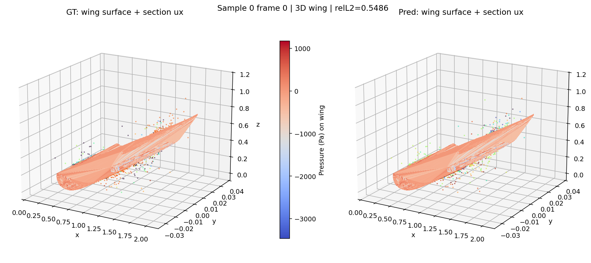 | 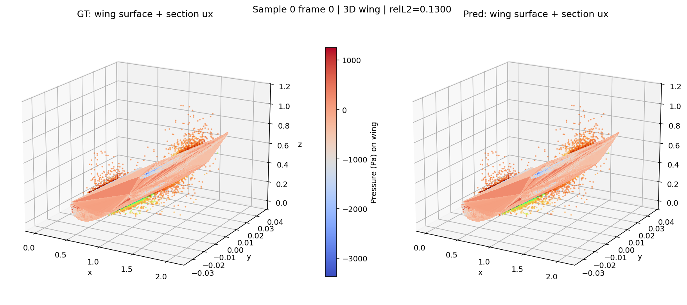 |
| 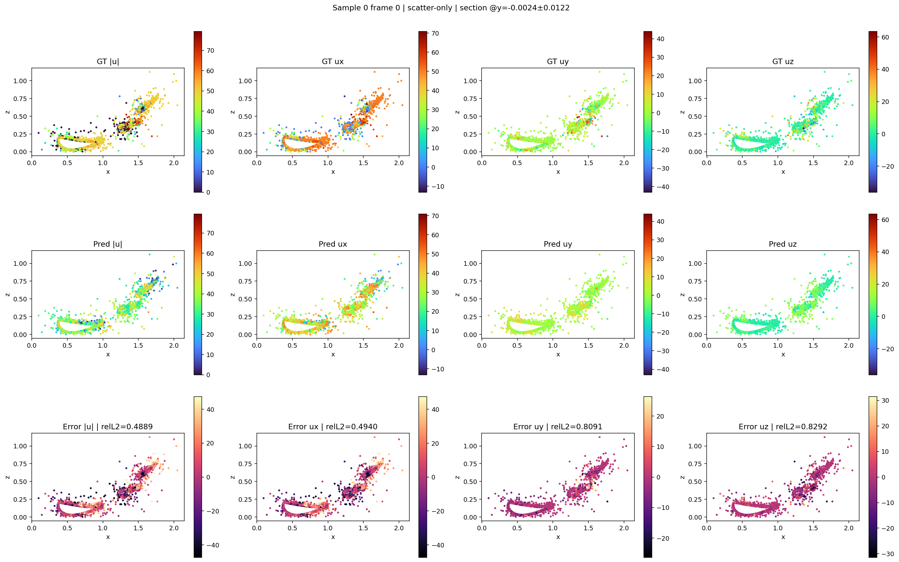 | 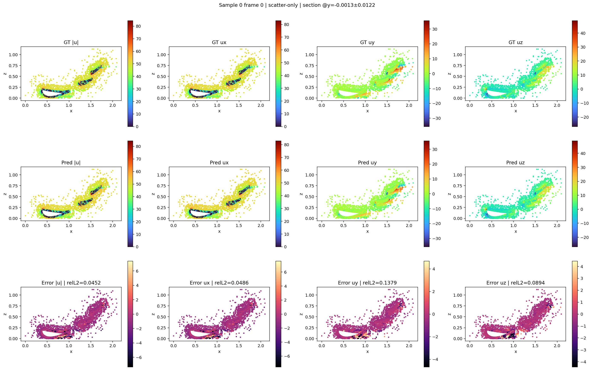 |
| 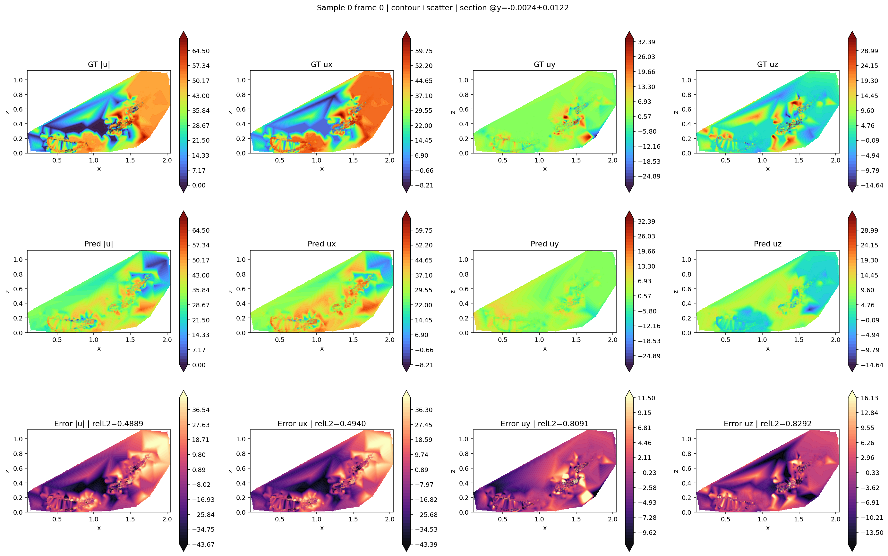 | 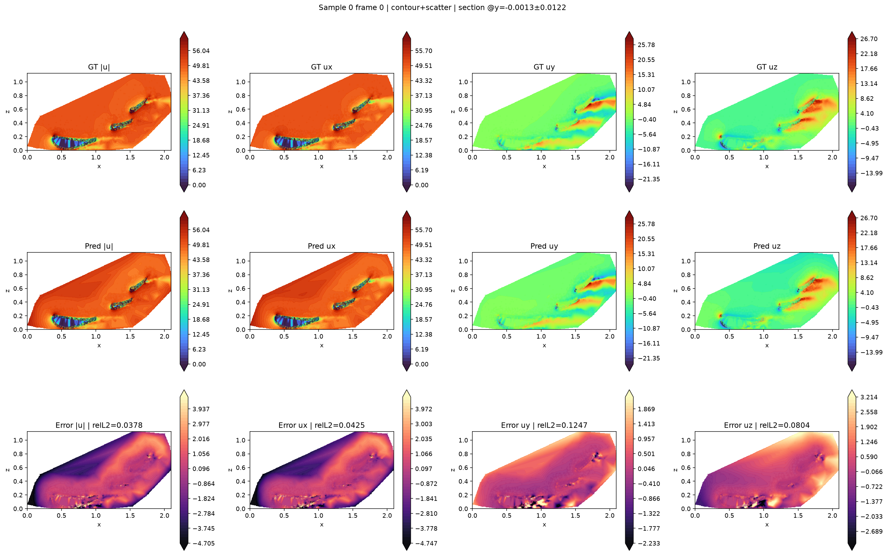 |

A multi-sample qualitative summary for TransolverAR is also included and provides evidence that the model works across multiple unseen airfoil / wing configurations rather than only a single held-out case:

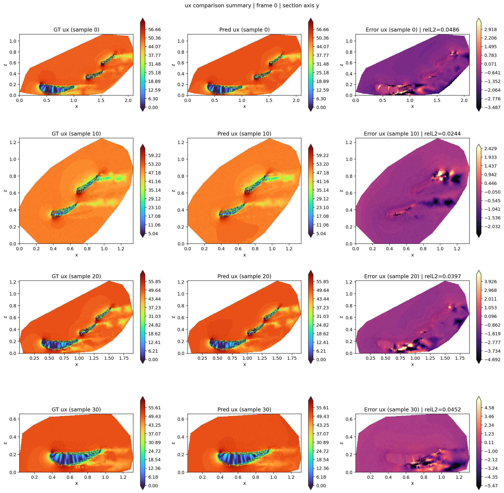

## Accuracy

The most directly labelled quantitative comparison available from the supplied diagnostic outputs is the held-out **sample-0 point-level relative L2**:

| Metric | FNO | TransolverAR |
|---|---:|---:|
| Relative L2 (sample 0 overall) | 0.5486 | **0.1226** |
| Relative L2 (sample 0, $$|u|$$ error panel) | 0.4889 | **0.0378** |
| Relative L2 (sample 0, $$u_x$$ error panel) | 0.4940 | **0.0425** |
| Relative L2 (sample 0, $$u_y$$ error panel) | 0.8091 | **0.1247** |
| Relative L2 (sample 0, $$u_z$$ error panel) | 0.8292 | **0.0804** |

These are **sample-level diagnostic values**, not final dataset-wide means for both repository pipelines, but they provide the clearest like-for-like comparison available from the supplied result artifacts. For TransolverAR, the competition-style dataset-level result above additionally provides a broader ranking context.

## Accuracy diagnostics

| FNO | TransolverAR |
|:---:|:---:|
| 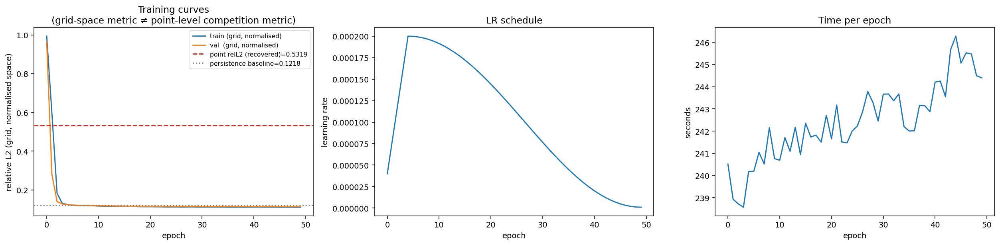 |  |

For FNO, the training-curve panel explicitly shows that the optimisation curves are measured in **normalised grid space**, which is not the same metric as the final point-level comparison metric.

## Component-wise diagnostics

| FNO | TransolverAR |
|:---:|:---:|
| 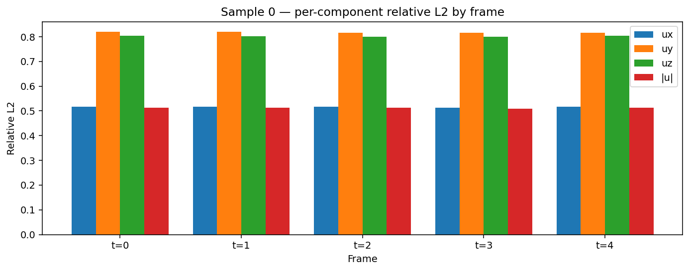 | 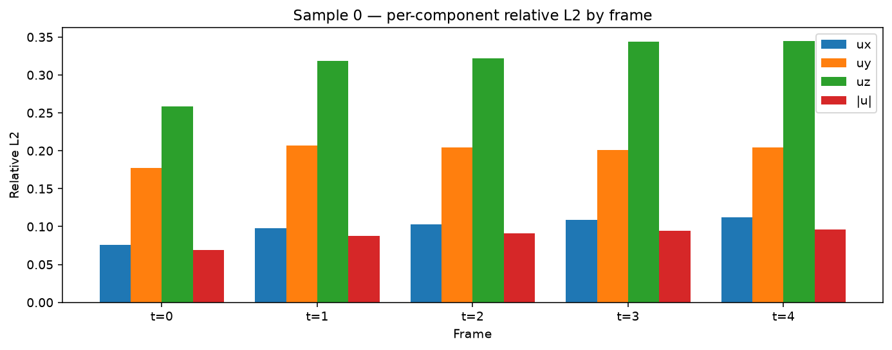 |
| 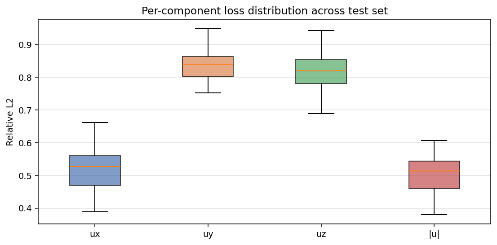 | 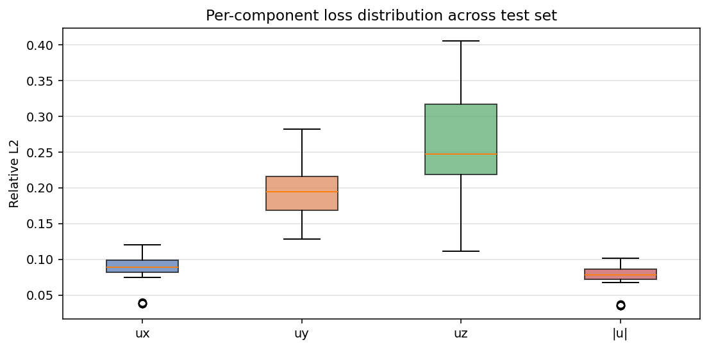 |

The component-loss plots show a consistent gap in favour of **TransolverAR**. In the supplied diagnostics, FNO exhibits substantially larger errors in $$u_y$$ and $$u_z$$, while TransolverAR keeps all four reported channels lower, including $$|u|$$.

## Batch metrics files

The most appropriate tabular files for sample-by-sample comparison are the batch-report CSVs:

- [FNO_batch_report_metrics.csv](FNO/outputs/report/batch_report_metrics.csv)
- [Transolver_batch_report_metrics.csv](Transolver/outputs/report/batch_report_metrics.csv)

These are the best CSV artifacts to inspect when you want per-sample relative-L2 rankings for the two pipelines.

## Summary

| Metric | FNO | TransolverAR |
|---|---|---|
| Representation | Voxelised 3D grid $$\rightarrow$$ interpolate back to points | Direct irregular mesh / point cloud |
| Geometry handling | Regular grid mapping | Native irregular geometry |
| Held-out sample 0 relative L2 | 0.5486 | **0.1226** |
| Held-out sample 0 $$|u|$$ relative L2 | 0.4889 | **0.0378** |
| Held-out sample 0 $$u_x$$ relative L2 | 0.4940 | **0.0425** |
| Held-out sample 0 $$u_y$$ relative L2 | 0.8091 | **0.1247** |
| Held-out sample 0 $$u_z$$ relative L2 | 0.8292 | **0.0804** |
| Competition-style dataset result | not supplied in matched form | **0.0638 ± 0.0198** |
| Approx. competition rank | not directly established from supplied artifacts | **7th** |
| Multi-geometry qualitative evidence | Not supplied in comparable summary form | Included via multi-sample $$u_x$$ summary |

On the supplied result artifacts, **TransolverAR clearly outperforms the FLOREN FNO voxel-grid baseline**. The comparison supports the main FLOREN hypothesis: forcing irregular CFD-style point clouds onto a regular voxel grid introduces non-trivial representation loss, while modelling directly on the irregular mesh preserves geometric detail better and yields substantially stronger predictive fidelity.

## Notes

- The headline FNO-vs-Transolver values above are based on the **provided diagnostic plots** for the illustrated held-out sample.
- The batch CSV files should be treated as the main tabular artifacts for broader sample-by-sample inspection.
- The reported **7th-place** ranking comes from the external leaderboard table supplied by the user and corresponds to the listed **TransolverAR** result of **0.0638 ± 0.0198**.
- If you later generate final matched dataset-level scalar summaries such as test-set mean relative L2, standard deviation, nRMSE, best epoch, or runtime for both FLOREN pipelines, this page can be extended into a fuller benchmark table in exactly the same style as the Darcy example.
